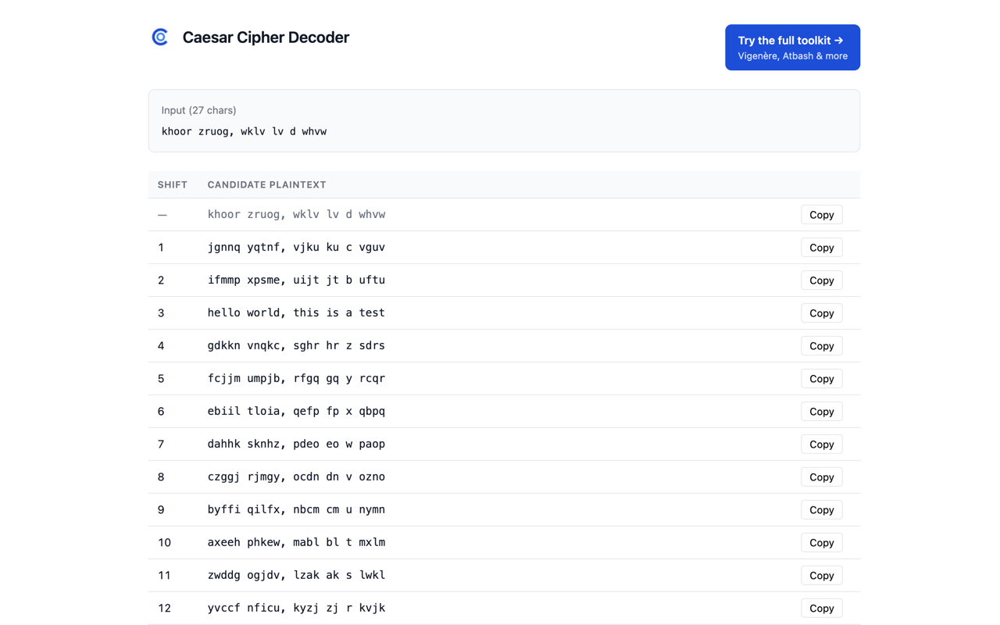

# Caesar Cipher Decoder — Chrome Extension

> Right-click any selected text on any web page to instantly see all 25 Caesar-cipher shifts. Offline, zero tracking, open source. Companion to **[caesarcipher.org](https://caesarcipher.org)**.

## Features

- One right-click → all 26 shift candidates (0 = original, 1–25 = decoded)
- 100% offline — no network calls, no tracking, no storage
- Only one Chrome permission: `contextMenus`
- Click-to-copy on any candidate row
- Handles selections up to 2000 characters; Unicode passes through unchanged

## Install

- **Chrome Web Store:** _(link added once published)_
- **From source:**
  1. Clone this repo
  2. Open `chrome://extensions`
  3. Enable **Developer mode**
  4. Click **Load unpacked**, select the repo folder

## Need more cipher tools?

This extension is deliberately single-purpose. For Vigenère, Atbash, Autokey, Rail Fence, Playfair, and 20+ other classical ciphers — plus encoding, frequency analysis, and step-by-step walkthroughs — use the full web toolkit at **[caesarcipher.org](https://caesarcipher.org)**.

## How it works

The algorithm is a standard Caesar shift applied only to ASCII A–Z / a–z characters; everything else (spaces, punctuation, digits, CJK, emoji) passes through untouched.

For each candidate shift `n ∈ [0, 25]`, the ciphertext is reversed by `n` positions modulo 26 — i.e., the "Shift n" row shows what the plaintext would be if the ciphertext had been encrypted with Caesar +n. So ciphertext encrypted with a +3 shift is decoded on the "Shift 3" row. The result page shows all 26 rows at once so you can eyeball the plaintext — for short ciphertexts that's the fastest solution. Implementation is ~20 lines in `lib/caesar.js`.

## Build icons from SVG

The extension icons are generated from the main-site SVG logo:

    brew install librsvg          # one-time
    ./scripts/build-icons.sh      # writes icons/icon-{16,48,128}.png

## Develop & test

    npm test                      # runs node:test unit tests for the algorithm

To iterate on the UI, load the extension unpacked, edit files, and click the refresh icon on its card in `chrome://extensions`.

## Package for Chrome Web Store submission

    ./scripts/build-zip.sh        # writes dist/caesar-cipher-decoder-<version>.zip

The zip excludes dev-only files (tests, scripts, store-assets, docs, README, LICENSE, PRIVACY.md, package.json, .git).

## Privacy

See [PRIVACY.md](PRIVACY.md). Short version: the extension collects, transmits, and stores nothing.

## License

MIT — see [LICENSE](LICENSE).
